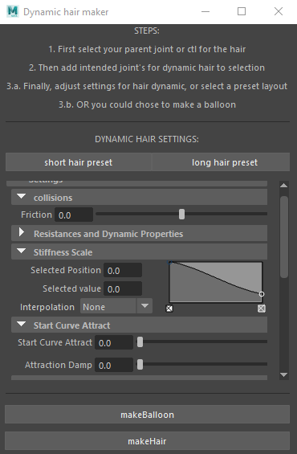
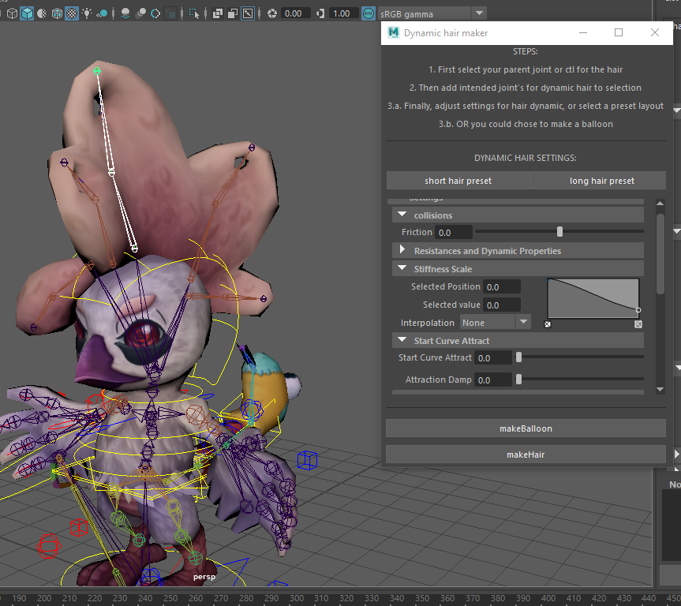
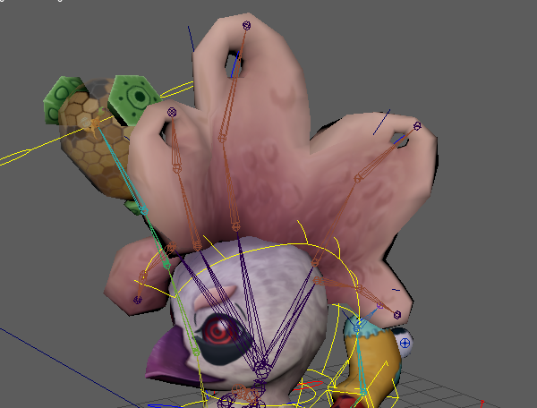
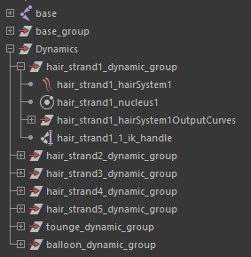

# Pythonic Hair Dynamics Tool written for Autodesk Maya 2018

    A script to rig hair dynamics in autodesk maya for the purpose of making..
    .. dynamic animations for games

## Prerequisites:

* PyQt5
* Autodesk Maya 2018

## Built with:

* PyQt5
* Maya.cmds
* Maya.mel

## Main UI window :

    A ui design I made with maya.cmds to mimic the hair dynamics setting window..
    .. so that you can set the settings ahead of time and have preloaded settings

## How to use:

    Run the script in real time through the script editor in Autodesk Maya.
    
### Step 1: Select joint chain

    Select the object or joint that is going to be a parent to the hair dynamic..
    .. and then select every join in the chain starting from the base and..
    .. selecting all the way down to the end joint.

### Step 2: Run the Script:

    Run the script in the editor and the script will build the hair dynamic..
    .. and organize the outputs.

